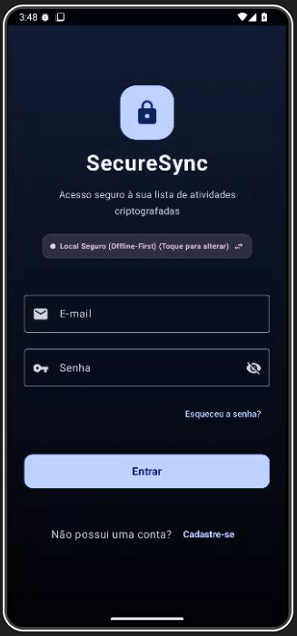

# 🔐 SecureSync | Gerenciador de Tarefas Seguro e Inteligente

<p align="center">
  
  
  
  
  
</p>

---

## 📸 Banner & Interface do Aplicativo

> [!TIP]


<p align="center">
  

</p>

---

## 🌟 O que é o SecureSync?

O **SecureSync** é um aplicativo nativo para Android desenvolvido em **Jetpack Compose** que une **segurança robusta offline** e **sincronização na nuvem** de maneira inteligente. 

Ele é projetado para pessoas que demandam controle absoluto sobre suas obrigações cotidianas e tarefas pessoais, com o diferencial de permitir uma transição suave entre o modo totalmente privado (local offline com dados criptografados em banco Room) e o modo sincronizado em nuvem (via Firebase Auth e Firestore).

---

## ✨ Funcionalidades Principais

*   **🎮 Modo de Execução Híbrido (Dual Mode):**
    *   **Modo Cloud (Firebase):** Sincronização em tempo real de tarefas e categorias com o Firebase.
    *   **Modo Local Offline:** Operação 100% privada e local. Caso ocorra erro de conexão ou o console do Firebase não esteja configurado, o app sugere e permite alternar instantaneamente para o Modo Offline sem perder a experiência de uso.
*   **🛡️ Criptografia e Segurança:**
    *   Armazenamento seguro de preferências e status usando **Secure DataStore**.
    *   Algoritmos locais de criptografia para as chaves de acesso no dispositivo.
*   **🎨 UI/UX Impecável com Material Design 3 (M3):**
    *   Suporte a Temas Modernos e confortáveis para leitura.
    *   Visualização clara por categorias personalizáveis (com cores e ícones dedicados).
    *   Filtros dinâmicos e controle de tarefas concluídas com gestos e animações fluidas.
*   **🗄️ Arquitetura Offline-First:**
    *   Utiliza o **Room Database** para cache inteligente das categorias e tarefas locais.
    *   Alimentação inteligente de dados iniciais (seeding) no banco de dados local logo na primeira inicialização.

---

## 🛠️ Detalhes da Arquitetura

O projeto foi construído seguindo os mais altos padrões de engenharia recomendados pelo Google:

```
├── app
│   └── src
│       └── main
│           └── java
│               └── com.example
│                   ├── data
│                   │   ├── local      # Room DB, DAOs, Entidades, Secure DataStore
│                   │   ├── model      # Modelos de dados (User, Task, Category)
│                   │   ├── remote     # Firebase Auth e Integração Firestore
│                   │   └── repository # Repositórios unificados de dados e auth
│                   ├── ui
│                   │   ├── screens    # Telas em Compose (Dashboard, Login, SignUp, etc.)
│                   │   ├── theme      # Configurações do Tema Material 3
│                   │   └── viewmodel  # StateFlows e Lógica de Apresentação (MVVM)
```

### Tecnologias Utilizadas:
-   **Kotlin Coroutines & Flows:** Para programação assíncrona reativa e livre de travamentos no fio principal de execução (Main Thread).
-   **MVVM (Model-View-ViewModel):** Lógica de negócios isolada da camada visual de forma limpa e testável.
-   **Room Database (com KSP):** Suporte nativo a persistência relacional local.
-   **Firebase Suite (Auth, Firestore):** Login por E-mail/Senha e backup das tarefas em tempo real.

---

## 🚀 Como Executar o Projeto

### Pré-requisitos:
*   Android Studio Ladybug (ou mais recente).
*   JDK 17 ou superior.
*   Dispositivo físico Android ou Emulador executando API 26 (Android 8) ou superior.

### Passo a Passo:

1.  **Clonar o Repositório:**
    ```bash

    git clone https://github.com/marconesdb/SecureSync.git

    cd SecureSync
    ```
2.  **Abrir no Android Studio:**
    Abra a pasta clonada como um projeto Gradle e aguarde a sincronização dos arquivos (`sync gradle`).

3.  **Configurar o Firebase (Opcional):**
    Se deseja utilizar a sincronização na nuvem:
    *   Crie um projeto no [Console do Firebase](https://console.firebase.google.com/).
    *   Adicione um app Android com o applicationId do seu projeto (verifique no `app/build.gradle.kts`).
    *   Baixe o arquivo `google-services.json` e insira-o no diretório `app/`.
    *   Ative o provedor **E-mail/Senha** no menu *Authentication > Método de login*.
    *   Ative o **Cloud Firestore** em modo de teste ou de produção.
    
    > **💡 Dica:** Se escolher usar sem Firebase, o app detecta isso de forma inteligente e oferece um botão rápido para ativar o **Modo Local Offline**, rodando tudo no seu aparelho de graça de forma segura!

4.  **Compilar e Rodar:**
    Clique no botão de **Run** (Executar) no Android Studio.

---

## 🤝 Contribuição

Fique à vontade para abrir uma *Issue* ou enviar um *Pull Request* se encontrar algo para melhorar! Toda sugestão artística ou de código será muito bem-vinda para tornar o **SecureSync** ainda melhor!

---

<p align="center">
  Desenvolvido por Marcone S. de Brito para um gerenciamento mais seguro e prático.
</p>

